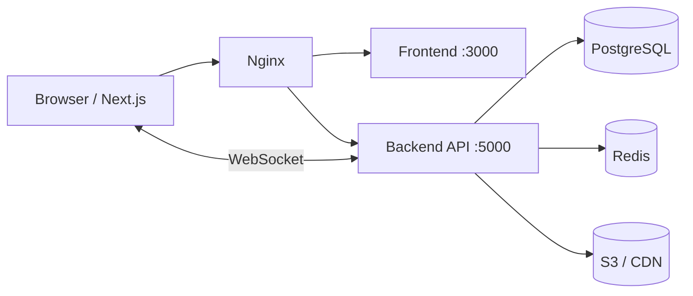
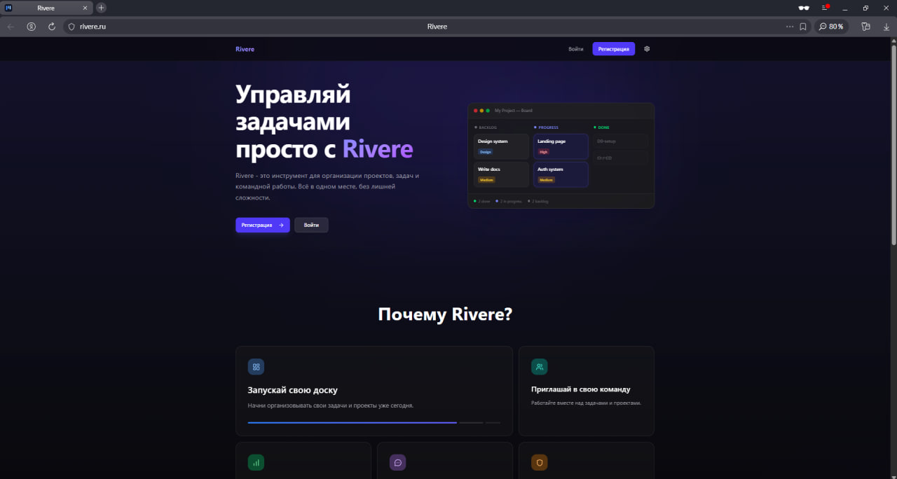
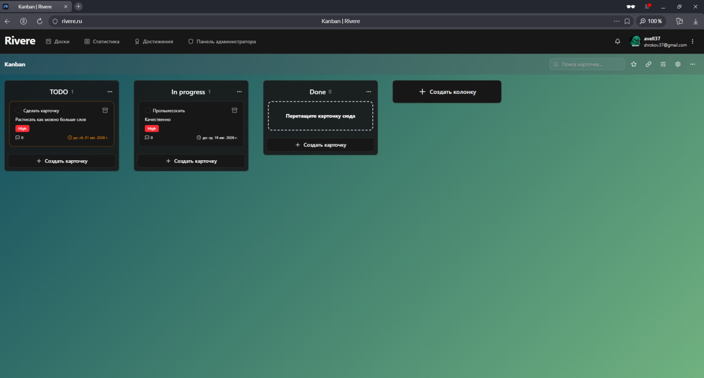
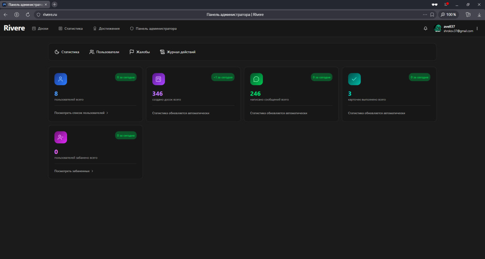

# Rivere

SaaS-платформа для управления проектами и задачами в формате Kanban: доски, колонки, карточки, real-time коллаборация, чат, уведомления и admin-панель.

**Live demo:** [rivere.ru](https://rivere.ru)

**Автор:** [Sergey Shirokov](https://github.com/avell37) · Telegram: [@avell37](https://t.me/avell37)

---

## О проекте

Rivere — full-stack приложение уровня production: от auth и RBAC до WebSocket-синхронизации, модерации контента, gamification и observability (Sentry, health checks, Telegram-алерты).

Монорепозиторий:

```
Rivere/
├── frontend/   # Next.js 16 (App Router), FSD
├── backend/    # NestJS 11, Prisma 7
├── docker-compose.yml
└── .github/workflows/   # CI/CD
```

---

## Основные возможности

### Kanban и продукт

- Drag-and-drop карточек и колонок (`@dnd-kit`) с optimistic UI
- Карточки: дедлайны, приоритеты, теги, исполнители, вложения (S3/CDN)
- Фильтры доски: поиск, приоритет, статус, дедлайн, исполнитель
- Архивация досок / колонок / карточек, избранное, фон доски
- Activity log с infinite scroll
- Deep link на карточку (`?card=...`)
- Статистика продуктивности, система achievements (15+)

### Real-time

- Синхронизация досок между пользователями (Socket.io)
- Чат на доске с @mentions
- Push-уведомления
- Live-события модерации (ban / unban)

### Auth и безопасность

- Регистрация, login, email verification
- Восстановление пароля (OTP)
- OAuth (Yandex)
- Cookie-based sessions (Redis), управление активными сессиями
- Next.js middleware для protected / admin routes

### RBAC

- **Глобальные роли:** CREATOR / ADMIN / USER
- **Роли на доске:** OWNER / ADMIN / MEMBER + permission matrix на UI
- Инвайты участников по токену

### Admin

- Список пользователей, ban с причиной и сроком
- Жалобы (reports) и resolve-flow
- Audit log (действия администраторов)
- Статистика платформы

### Прочее

- i18n (RU / EN) через `next-intl`
- Dark / light theme
- SEO: sitemap, robots, OG, manifest
- Загрузка аватаров и файлов в S3

---

## Tech Stack

### Frontend

|            |                                                           |
| ---------- | --------------------------------------------------------- |
| Framework  | **Next.js 16** (App Router), **React 18**, **TypeScript** |
| State      | **TanStack Query v5**, **Zustand**                        |
| UI         | **Tailwind CSS v4**, **shadcn/ui**, Radix UI, Lucide      |
| Forms      | **React Hook Form**, **Zod**                              |
| Real-time  | **socket.io-client**                                      |
| DnD        | **@dnd-kit**                                              |
| i18n       | **next-intl**                                             |
| Monitoring | **Sentry**                                                |
| Tests      | **Vitest**, Testing Library                               |

**Архитектура:** [Feature-Sliced Design](https://feature-sliced.design/) — `app / entities / features / widgets / shared`

### Backend

|                  |                                                                              |
| ---------------- | ---------------------------------------------------------------------------- |
| Framework        | **NestJS 11**, **TypeScript**                                                |
| ORM              | **Prisma 7**, **PostgreSQL**                                                 |
| Cache / Sessions | **Redis** (ioredis)                                                          |
| Real-time        | **Socket.io** (5 gateway: boards, chat, notifications, achievements, events) |
| Storage          | **AWS S3**                                                                   |
| Auth             | express-session, connect-redis, **Argon2**, OAuth Yandex                     |
| Mail             | React Email                                                                  |
| Monitoring       | **Sentry**, Telegram Bot API, health / ready probes                          |
| Tests            | **Jest**                                                                     |
| API docs         | Swagger                                                                      |

### Infrastructure

- **Docker** + **docker-compose** (multi-stage builds)
- **Nginx** + Let's Encrypt
- **GitHub Actions:** lint → test → build → deploy → smoke checks
- CDN для медиа: `cdn.rivere.ru`

---

## Архитектура



**Frontend (FSD):**

```
frontend/src/
├── app/          # Route groups: (public), (protected), (admin)
├── entities/     # Board, Card, Column, User, Chat, Notification…
├── features/     # auth, drag-and-drop, admin, filters, chat…
├── widgets/      # Kanban-board, Admin, Header…
└── shared/       # ui, api, providers, utils, i18n
```

**Backend (NestJS modules):**

```
Auth · Board · Column · Card · Chat · Notifications
Achievements · Statistics · Admin · Reports · Monitoring · Cron
```

---

## Скриншоты

| Landing                                    | Kanban board                           | Admin panel                            |
| ------------------------------------------ | -------------------------------------- | -------------------------------------- |
|  |  |  |

Live-версия: **[rivere.ru](https://rivere.ru)** — регистрация и создание доски занимают ~1 минуту.

---

## Локальный запуск

### Требования

- **Node.js 20+**
- **Docker** и **Docker Compose** (для PostgreSQL / Redis) или локальные инстансы
- npm

### 1. Клонирование

```bash
git clone https://github.com/avell37/rivere.git
cd rivere
```

### 2. Backend

```bash
cd backend
cp .env.example .env
# Заполните DATABASE_URL, REDIS_URL, COOKIES_SECRET, SESSION_SECRET и др.

npm install
npx prisma generate
npm run db:migrate:dev
npm run db:seed          # опционально: seed achievements и т.д.
npm run start:dev        # http://localhost:5000
```

Swagger (dev): `http://localhost:5000/api/docs`

### 3. Frontend

```bash
cd frontend
cp .env.example .env
# NEXT_PUBLIC_SERVER_URL=http://localhost:5000/api

npm install
npm run dev              # http://localhost:3000
```

### 4. Docker (production-like)

Из корня репозитория:

```bash
# Подготовьте backend/.env.production и frontend/.env.production
docker compose up -d --build
```

Health check: `GET /api/health` · Readiness: `GET /api/ready`

---

## Тесты

```bash
# Frontend (Vitest)
cd frontend && npm test

# Backend (Jest)
cd backend && npm test
```

CI прогоняет lint + test + build для обоих пакетов на каждый push в `main`.

---

## CI/CD

```
push to main
    → check (lint, test, build)
    → deploy via SSH
    → smoke: /api/health, /api/ready
```

Workflows: [`.github/workflows/check.yml`](./.github/workflows/check.yml), [`.github/workflows/deploy.yml`](./.github/workflows/deploy.yml)

---

## API Endpoints (кратко)

| Method | Path          | Описание                       |
| ------ | ------------- | ------------------------------ |
| GET    | `/api/health` | Liveness probe                 |
| GET    | `/api/ready`  | Readiness (PostgreSQL + Redis) |
| —      | `/api/docs`   | Swagger (dev)                  |

WebSocket namespaces: `/api/boards`, `/api/chat`, `/api/notifications`, `/api/achievements`, `/api/events`

---

## Переменные окружения

| Файл                                               | Назначение                                   |
| -------------------------------------------------- | -------------------------------------------- |
| [`backend/.env.example`](./backend/.env.example)   | DB, Redis, S3, OAuth, Mail, Sentry, Telegram |
| [`frontend/.env.example`](./frontend/.env.example) | API URL, S3 CDN, Sentry                      |

---

## Контакты

- **GitHub:** [@avell37](https://github.com/avell37)
- **Telegram:** [@avell37](https://t.me/avell37)
- **Email:** shrokov.37@gmail.com
- **Demo:** [rivere.ru](https://rivere.ru)

---

## License

Private / All rights reserved. Исходный код предоставляется для ознакомления с архитектурой и портфолио. Коммерческое использование без согласования с автором запрещено.
